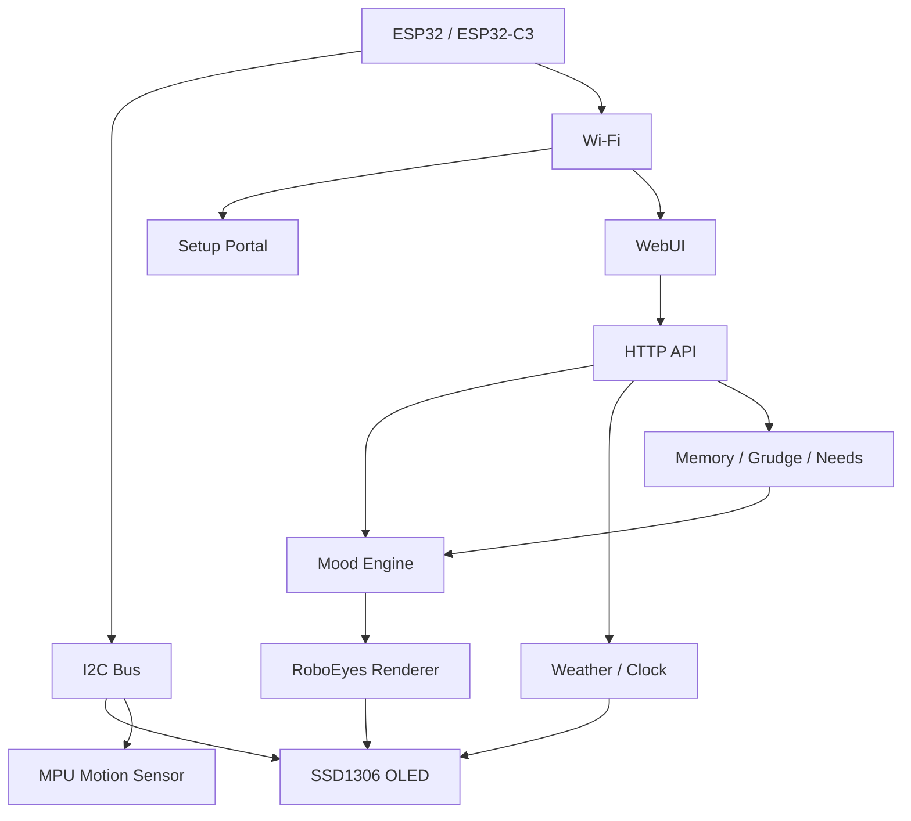

<div align="center">

# YETI

### A tiny ESP32-C3 OLED desktop robot buddy with RoboEyes, moods, weather, motion reactions, memory, sass, and sleep mode.


</div>

---

## What is YETI?

**YETI** is firmware for a small ESP32-powered desktop companion using a 128x64 I2C OLED display. It gives a tiny robot face personality through animated RoboEyes, Wi-Fi setup, a mobile-friendly WebUI, motion reactions, weather/time tickers, persistent emotional memory, configurable moods, and scheduled sleep behavior.

This project is currently centered around an **ESP32-C3 Super Mini** style board, but the sketch also includes a classic ESP32 DevKit/WROOM profile and a custom hardware profile for other wiring layouts.

> YETI is not trying to be useful in a normal appliance way. YETI is trying to be a tiny judgmental desktop creature. Important distinction.

---

## Current checkpoint

| Item | Value |
|---|---|
| Firmware version | `1.7.4-sleep-preview-compile-fix` |
| Primary board target | ESP32-C3 Super Mini / ESP32-C3 Dev Module target |
| Face engine | FluxGarage RoboEyes by default |
| Display | SSD1306 128x64 I2C OLED, usually address `0x3C` |
| Motion sensor | MPU6050 / MPU6500 style I2C gyro/accelerometer, usually address `0x68` |
| Setup mode | Captive Wi-Fi portal at `192.168.4.1` |
| Normal WebUI | `http://yeti.local/` or the device IP address |
| Important compile setting | `Huge APP (3MB No OTA / 1MB SPIFFS)` partition |

---

## Table of contents

- [Features](#features)
- [Hardware](#hardware)
- [Wiring](#wiring)
- [Software requirements](#software-requirements)
- [Compile and flash with Arduino IDE](#compile-and-flash-with-arduino-ide)
- [Compile and flash with Arduino CLI](#compile-and-flash-with-arduino-cli)
- [First-run setup](#first-run-setup)
- [Using the WebUI](#using-the-webui)
- [Board profiles and pin configuration](#board-profiles-and-pin-configuration)
- [Serial commands](#serial-commands)
- [API overview](#api-overview)
- [Troubleshooting](#troubleshooting)
- [Security notes](#security-notes)
- [Roadmap ideas](#roadmap-ideas)
- [License](#license)

---

## Features

### OLED robot face

- Animated OLED robot face using **FluxGarage RoboEyes**.
- Classic fallback renderer still exists in the sketch.
- Expressions/moods include deadpan, happy, angry, sleepy, curious, startled, smug, sad, weather-themed, and booting behavior.
- Configurable face refresh pacing to balance animation smoothness against WebUI responsiveness.
- Default face frame interval is approximately **83 ms**, around **12 FPS**, which is a good compromise for a tiny I2C OLED.

### Wi-Fi setup portal

- First-run setup mode starts a temporary access point.
- Setup AP name format:

```text
Yeti-Setup-XXXX
```

- Captive portal DNS redirect is enabled.
- Setup portal IP:

```text
http://192.168.4.1
```

- Stores Wi-Fi credentials in ESP32 Preferences/NVS.
- Configurable hostname, defaulting to:

```text
yeti
```

- After setup, YETI should usually be reachable at:

```text
http://yeti.local/
```

If `.local` does not resolve on your network, use the IP address shown on the OLED or in the Serial Monitor.

### Mobile-friendly WebUI

The WebUI is designed as multiple pages/sections instead of one giant constantly-refreshing dashboard. This helps on weaker Wi-Fi and small ESP32 boards.

WebUI features include:

- Live status dashboard.
- Mood controls.
- Personality preset controls.
- Weather setup and test actions.
- Clock setup and display controls.
- OLED info cards.
- Sleep mode controls.
- Sensor diagnostics.
- I2C scan diagnostics.
- Event log.
- System stats.
- Reboot button.
- Wi-Fi forget/reset workflow.

### Weather support

- Uses **Open-Meteo** current weather data.
- No API key required.
- Supports saved latitude/longitude.
- Supports metric/imperial display preference.
- Weather ticker fields are individually configurable.

Configurable ticker fields include:

- Location.
- Temperature.
- Condition.
- Feels like.
- Humidity.
- Wind.
- Precipitation.
- Last updated time.

### Clock and time display

- NTP-backed clock.
- Configurable manual UTC offset.
- Optional weather/timezone offset behavior when weather data is available.
- OLED clock display mode.
- OLED date display mode.
- Large scrolling ticker-style display for readable tiny-screen output.

Default manual offset in the sketch is:

```text
-420 minutes
```

That is Pacific Daylight Time. Change it in the WebUI for your own location.

### Sleep mode

YETI includes a scheduled sleep behavior system.

Default sleep schedule:

| Setting | Default |
|---|---:|
| Sleep start | `21:00` / 9:00 PM |
| Sleep end | `06:00` / 6:00 AM |
| Sleep animation duration | `12000 ms` |
| Sleep animation gap | `45000` to `180000 ms` |
| Wake hold after manual wake | `900000 ms` / 15 minutes |

Sleep mode behavior:

- OLED spends most of the sleep window off/blank.
- Periodic sleepy `Zzz` animation bursts.
- WebUI **Sleep Now** action.
- WebUI **Wake Now** action.
- WebUI sleep preview action.
- Shake/WebUI wake support.
- Wake override period before the schedule can reclaim sleep mode.

> Note: this is currently a display/behavior sleep system, not a full ESP32 deep-sleep power shutdown system.

### Motion reactions

YETI can react to movement using an MPU6050/MPU6500-style I2C motion sensor.

Supported behavior includes:

- Movement detection.
- Shake detection.
- Tilt/pick-up style reactions.
- Long-still sleepy behavior.
- Sensitivity sliders.
- Cooldowns to avoid constant mood spam.
- Sensor diagnostics in the WebUI.

No separate MPU library is required. The sketch talks to the sensor over I2C directly.

### Touch reactions

Classic ESP32 DevKit/WROOM profile supports built-in capacitive touch on:

```text
T0 / GPIO4
```

ESP32-C3 Super Mini profile disables built-in touch because ESP32-C3 boards do not expose the same classic ESP32 `touchRead()` pad setup.

If you want touch on the ESP32-C3 version, use an external touch module or button and add support for that GPIO.

### Personality system

YETI has a mood/personality layer on top of the face renderer.

Personality presets include:

| Preset | Personality vibe |
|---|---|
| Classic | Balanced default YETI behavior |
| Friendly | Happier, friendlier, less goblin turbulence |
| Sleepy YETI | Lower energy, sleepy idles, haunted paperweight energy |
| Feral Goblin | Higher chaos/grumpiness, more attitude |
| Weather Gremlin | Weather-reactive sky gossip creature |

Adjustable personality traits:

- Grumpiness.
- Curiosity.
- Sleepiness.
- Chaos.
- Friendliness.

### Persistent memory and grudge system

YETI includes a lightweight persistent memory system stored in ESP32 Preferences/NVS.

This is not an LLM brain or a chat memory. It is small emotional bookkeeping for robot personality behavior.

Tracked behavior includes:

- Pokes.
- Shakes.
- Wi-Fi problems.
- Weather failures.
- Reboots.
- WebUI visits.
- Commands.
- Mood counts.
- Today/yesterday memory rollover.
- Relationship-ish counters like trust, affection, patience, and annoyance.
- Grudges that decay over time.

Flash writes are throttled to avoid hammering NVS.

### Sass ticker

Optional OLED sass phrases can appear based on:

- Idle behavior.
- Memory state.
- Grudges.
- Needs.
- Events.
- Current judgment.

The sass overlay is guarded so it does not stomp over setup screens, clock/weather displays, or important status messages.

### Diagnostics

Useful diagnostics exposed through the WebUI/status API include:

- Firmware version.
- Board profile.
- IP address.
- RSSI.
- mDNS hostname.
- Free heap.
- Sketch size.
- Flash size.
- App slot size/free space.
- I2C scan results.
- OLED status.
- MPU status.
- Touch status where supported.
- Event log.
- Current mood/personality state.
- Memory/grudge/needs summaries.

---

## Hardware

### Recommended build

| Part | Notes |
|---|---|
| ESP32-C3 Super Mini | Small board, USB-C on many versions, works well for tiny robot bodies |
| 0.96 inch SSD1306 OLED | 128x64 I2C, usually address `0x3C` |
| MPU6050 / MPU6500 module | I2C motion sensor, usually address `0x68` |
| Wires / headers | Keep I2C wiring short if possible |
| 3.3V power source | USB for development; battery system optional |

### Also supported

| Board | Status |
|---|---|
| ESP32-C3 Super Mini | Primary tiny build profile |
| ESP32-C3 Dev Module target | Recommended Arduino board target for Super Mini style boards |
| ESP32 DevKit / WROOM | Supported profile with GPIO21/GPIO22 I2C and GPIO4 touch |
| Custom ESP32 wiring | Supported by editing the `YETI_BOARD_CUSTOM` profile |

---

## Wiring

### ESP32-C3 Super Mini wiring

This is the currently verified tiny-board wiring in the sketch.

| Device pin | ESP32-C3 Super Mini pin |
|---|---|
| OLED VCC | `3V3` |
| OLED GND | `GND` |
| OLED SDA | `GPIO1` |
| OLED SCL | `GPIO3` |
| MPU VCC | `3V3` |
| MPU GND | `GND` |
| MPU SDA | `GPIO1` |
| MPU SCL | `GPIO3` |

Expected I2C scan:

| Address | Device |
|---|---|
| `0x3C` | SSD1306 OLED |
| `0x68` | MPU6050 / MPU6500 |

> ESP32-C3 Super Mini boards are tiny chaos rectangles. Silkscreen labels vary. If the OLED or MPU is not found, check the actual GPIO labels for your board and edit the SDA/SCL values in the board profile.

### Classic ESP32 DevKit / WROOM wiring

| Device pin | ESP32 DevKit / WROOM pin |
|---|---|
| OLED VCC | `3V3` |
| OLED GND | `GND` |
| OLED SDA | `GPIO21` |
| OLED SCL | `GPIO22` |
| MPU VCC | `3V3` |
| MPU GND | `GND` |
| MPU SDA | `GPIO21` |
| MPU SCL | `GPIO22` |
| Touch input | `T0 / GPIO4` |

---

## Software requirements

Install the following before compiling:

| Requirement | Purpose |
|---|---|
| Arduino IDE 2.x or Arduino CLI | Compile and upload firmware |
| ESP32 board package by Espressif Systems | Adds ESP32/ESP32-C3 board support |
| Adafruit GFX Library | Graphics base library for OLED |
| Adafruit SSD1306 | OLED display driver |
| FluxGarage RoboEyes | Animated robot eyes face engine |

Built-in ESP32/Arduino libraries used by the sketch include:

- `WiFi`
- `WebServer`
- `DNSServer`
- `Preferences`
- `ESPmDNS`
- `HTTPClient`
- `WiFiClientSecure`
- `Wire`
- `time`

---

## Compile and flash with Arduino IDE

### 1. Install the ESP32 board package

In Arduino IDE:

1. Open **File → Preferences**.
2. In **Additional Boards Manager URLs**, add:

```text
https://espressif.github.io/arduino-esp32/package_esp32_index.json
```

3. Open **Tools → Board → Boards Manager**.
4. Search for:

```text
esp32
```

5. Install **esp32 by Espressif Systems**.

### 2. Install libraries

Open **Tools → Manage Libraries** and install:

```text
Adafruit GFX Library
Adafruit SSD1306
FluxGarage RoboEyes
```

If prompted to install dependencies, accept them.

### 3. Open the sketch

Open the YETI `.ino` sketch in Arduino IDE.

Arduino IDE expects the sketch file and folder to have matching names. If the IDE complains, place the sketch inside a folder with the same base name:

```text
yeti/
└── yeti.ino
```

### 4. Select the correct board

For an ESP32-C3 Super Mini, use:

| Arduino IDE menu | Setting |
|---|---|
| Board | `ESP32C3 Dev Module` |
| USB CDC On Boot | `Enabled` |
| Partition Scheme | `Huge APP (3MB No OTA/1MB SPIFFS)` |
| Upload Speed | Start with `460800`; use `921600` if stable |
| Port | Your detected USB serial port |

The two most important settings are:

```text
USB CDC On Boot: Enabled
Partition Scheme: Huge APP (3MB No OTA/1MB SPIFFS)
```

The sketch is large. The default partition layout may fail with a size error. Use **Huge APP**.

### 5. Compile

Click **Verify**.

A successful compile means the board package and libraries are installed correctly.

### 6. Upload

Click **Upload**.

If upload fails:

- Hold the board's **BOOT** button.
- Click **Upload** again.
- Release **BOOT** when the IDE shows that it is connecting/writing.
- Some boards also need a quick tap of **RESET** after upload.

### 7. Open Serial Monitor

Use:

```text
115200 baud
```

You should see YETI startup logs, hardware profile info, Wi-Fi status, setup portal info, and serial command help.

---

## Compile and flash with Arduino CLI

Arduino CLI is great if you are flashing from a Raspberry Pi, build box, or remote lab setup.

### 1. Install/update ESP32 core

```bash
arduino-cli core update-index
arduino-cli core install esp32:esp32
```

### 2. Install required libraries

```bash
arduino-cli lib install "Adafruit GFX Library"
arduino-cli lib install "Adafruit SSD1306"
arduino-cli lib install "FluxGarage RoboEyes"
```

If the RoboEyes library name is not found by CLI, install it from Arduino IDE Library Manager by searching for:

```text
FluxGarage RoboEyes
```

### 3. Find your board port

```bash
arduino-cli board list
```

Common port names:

| System | Possible port |
|---|---|
| Windows | `COM3`, `COM4`, etc. |
| Linux / Raspberry Pi | `/dev/ttyACM0` or `/dev/ttyUSB0` |
| macOS | `/dev/cu.usbmodemXXXX` or `/dev/cu.usbserialXXXX` |

### 4. Compile for ESP32-C3 Super Mini

Use this FQBN for the small ESP32-C3 Super Mini style build:

```bash
arduino-cli compile \
  --fqbn "esp32:esp32:esp32c3:CDCOnBoot=cdc,PartitionScheme=huge_app" \
  /path/to/yeti
```

That FQBN specifically enables:

```text
USB CDC On Boot = Enabled
Partition Scheme = Huge APP
```

### 5. Upload

Replace the port with your actual port:

```bash
arduino-cli upload \
  -p /dev/ttyACM0 \
  --fqbn "esp32:esp32:esp32c3:CDCOnBoot=cdc,PartitionScheme=huge_app" \
  /path/to/yeti
```

Windows example:

```powershell
arduino-cli upload `
  -p COM4 `
  --fqbn "esp32:esp32:esp32c3:CDCOnBoot=cdc,PartitionScheme=huge_app" `
  C:\path\to\yeti
```

### 6. Serial monitor

```bash
arduino-cli monitor -p /dev/ttyACM0 -c baudrate=115200
```

---

## First-run setup

When YETI has no saved Wi-Fi credentials, or saved credentials fail, it starts setup mode.

### Setup flow

1. Power on YETI.
2. Wait for the setup AP to appear:

```text
Yeti-Setup-XXXX
```

3. Connect to that Wi-Fi network from a phone or laptop.
4. Open:

```text
http://192.168.4.1
```

5. Select or enter your Wi-Fi network.
6. Enter Wi-Fi password.
7. Set hostname if desired.
8. Optionally configure weather location and units.
9. Save.
10. YETI reboots and joins your normal Wi-Fi.

After reboot, try:

```text
http://yeti.local/
```

If that does not work, use the IP address from Serial Monitor or the OLED network status display.

---

## Using the WebUI

Once connected to Wi-Fi, open the YETI WebUI:

```text
http://yeti.local/
```

or:

```text
http://<yeti-ip-address>/
```

### Main things you can do

| Area | What it controls |
|---|---|
| Dashboard | Current status, Wi-Fi, system info, event log |
| Face / Mood | Manual expressions, random mood, poke, calm, demo mode |
| Personality | Base mood, presets, trait sliders, automation toggles |
| Memory | Grudges, needs, memory counters, forgiveness/testing actions |
| Weather | Location, units, update interval, ticker fields |
| Clock | Time format, UTC offset, info card settings |
| Sensors | Shake/touch settings, motion sensitivity, diagnostics |
| Sleep | Schedule, Sleep Now, Wake Now, preview, animation/gap settings |
| System | Reboot, network display, reset/forget Wi-Fi |

---

## Board profiles and pin configuration

The sketch includes hardware profiles near the top of the file.

Available profiles:

```cpp
#define YETI_BOARD_ESP32_DEVKIT 1
#define YETI_BOARD_ESP32_C3_MINI 2
#define YETI_BOARD_CUSTOM 99
```

By default, the sketch auto-selects the ESP32-C3 Mini profile when compiling for ESP32-C3:

```cpp
#if defined(CONFIG_IDF_TARGET_ESP32C3) || defined(ARDUINO_ESP32C3_DEV)
  #define YETI_BOARD_PROFILE YETI_BOARD_ESP32_C3_MINI
#else
  #define YETI_BOARD_PROFILE YETI_BOARD_ESP32_DEVKIT
#endif
```

### Force a board profile

If you want to force a profile, define it before the auto-selection block:

```cpp
#define YETI_BOARD_PROFILE YETI_BOARD_ESP32_C3_MINI
```

or:

```cpp
#define YETI_BOARD_PROFILE YETI_BOARD_ESP32_DEVKIT
```

or:

```cpp
#define YETI_BOARD_PROFILE YETI_BOARD_CUSTOM
```

### ESP32-C3 Super Mini default profile

```cpp
#define YETI_I2C_SDA_PIN 1
#define YETI_I2C_SCL_PIN 3
#define YETI_OLED_ENABLED 1
#define YETI_OLED_I2C_ADDRESS 0x3C
#define YETI_MPU_ENABLED 1
#define YETI_MPU_I2C_ADDRESS 0x68
#define YETI_TOUCH_ENABLED 0
```

### Classic ESP32 DevKit default profile

```cpp
#define YETI_I2C_SDA_PIN 21
#define YETI_I2C_SCL_PIN 22
#define YETI_OLED_ENABLED 1
#define YETI_OLED_I2C_ADDRESS 0x3C
#define YETI_MPU_ENABLED 1
#define YETI_MPU_I2C_ADDRESS 0x68
#define YETI_TOUCH_ENABLED 1
#define YETI_TOUCH_PIN T0
```

### Custom profile

Use the custom profile when your board/wiring does not match the built-in defaults.

```cpp
#elif YETI_BOARD_PROFILE == YETI_BOARD_CUSTOM
  #define YETI_BOARD_PROFILE_NAME "Custom"
  #define YETI_I2C_SDA_PIN 21
  #define YETI_I2C_SCL_PIN 22
  #define YETI_OLED_ENABLED 1
  #define YETI_OLED_I2C_ADDRESS 0x3C
  #define YETI_OLED_RESET_PIN -1
  #define YETI_MPU_ENABLED 1
  #define YETI_MPU_I2C_ADDRESS 0x68
  #define YETI_TOUCH_ENABLED 1
  #define YETI_TOUCH_PIN T0
```

Only change what you need. For most board swaps, SDA and SCL are the important ones.

---

## Serial commands

Open Serial Monitor at:

```text
115200 baud
```

Available commands:

| Key | Action |
|---|---|
| `n` | Deadpan mood |
| `a` | Angry mood |
| `s` | Sleepy mood |
| `h` | Happy mood |
| `u` | Curious mood |
| `k` | Startled mood |
| `o` | Smug mood |
| `p` | Poke YETI |
| `x` | Calm down / return to base mood |
| `b` | Blink |
| `r` | Random mood |
| `d` | Demo mode |
| `i` | Show IP/network info on OLED |
| `t` | Show clock on OLED |
| `w` | Refresh/show weather on OLED |
| `c` | Recalibrate touch, classic ESP32 profile only |

---

## API overview

YETI exposes simple HTTP endpoints for the WebUI.

| Method | Endpoint | Purpose |
|---|---|---|
| `GET` | `/api/status` | Full device/status/config JSON |
| `GET` | `/api/scan` | Wi-Fi scan results |
| `GET` | `/api/i2c` | I2C bus scan results |
| `GET` | `/api/mood` | Current mood/personality state |
| `POST` | `/api/mood` | Set mood |
| `POST` | `/api/mood/base` | Set base mood |
| `POST` | `/api/mood/random` | Trigger random mood |
| `POST` | `/api/mood/poke` | Poke YETI |
| `POST` | `/api/mood/calm` | Calm YETI down |
| `POST` | `/api/personality/preset` | Apply personality preset |
| `GET` | `/api/memory` | Memory/grudge/needs status |
| `POST` | `/api/memory/save` | Force memory save |
| `POST` | `/api/memory/reset` | Reset memory |
| `POST` | `/api/sass/test` | Trigger sass phrase test |
| `POST` | `/api/sequence` | Trigger an acting sequence |
| `POST` | `/api/sequence/stop` | Stop active sequence |
| `POST` | `/api/action` | General actions such as reboot, sleep, wake, weather, show clock |
| `POST` | `/api/config` | Save main runtime configuration |
| `POST` | `/forget` | Forget Wi-Fi and reboot into setup mode |

Example status request:

```bash
curl http://yeti.local/api/status
```

Example I2C scan:

```bash
curl http://yeti.local/api/i2c
```

---

## Architecture



---

## Troubleshooting

### Sketch is too large

Use the **Huge APP** partition scheme.

Arduino IDE:

```text
Tools → Partition Scheme → Huge APP (3MB No OTA/1MB SPIFFS)
```

Arduino CLI:

```bash
--fqbn "esp32:esp32:esp32c3:CDCOnBoot=cdc,PartitionScheme=huge_app"
```

### ESP32-C3 uploads but Serial Monitor shows nothing

Make sure this is enabled:

```text
USB CDC On Boot: Enabled
```

Then unplug/replug the board and reopen Serial Monitor at `115200` baud.

### Upload fails or board is not detected

Try this ritual, because tiny boards enjoy drama:

1. Select the correct port.
2. Hold **BOOT**.
3. Start upload.
4. Release **BOOT** once writing begins.
5. Tap **RESET** after upload if needed.
6. Try a different USB cable if the port never appears.

Some USB cables are charge-only. Those are not cables. They are lies with insulation.

### OLED does not turn on

Check:

- VCC and GND.
- SDA/SCL pins.
- OLED I2C address.
- Whether your display is actually SSD1306-compatible.
- I2C scan results from `/api/i2c` or Serial Monitor.

Expected OLED address is usually:

```text
0x3C
```

### MPU does not show up

Check:

- VCC and GND.
- Shared SDA/SCL bus with OLED.
- I2C address.
- Some MPU boards use `0x68`; others may use `0x69` depending on AD0 wiring.

Expected default MPU address:

```text
0x68
```

### WebUI is slow or laggy

Try:

- Improve Wi-Fi signal.
- Increase face frame interval in the WebUI.
- Avoid ultra-fast OLED refresh settings.
- Use a solid USB power source.
- Keep I2C wires short.

The SSD1306 framebuffer flush is blocking, and the ESP32-C3 is doing Wi-Fi, WebUI, weather, sensors, personality, and tiny OLED theater at the same time. Respect the goblin CPU.

### `yeti.local` does not work

Use the IP address instead.

mDNS can be unreliable depending on router, OS, VPN, browser, or local firewall settings.

### Weather does not work

Check:

- YETI is connected to Wi-Fi.
- Latitude and longitude are valid.
- Weather is enabled.
- Internet access is available.
- Manual coordinates are entered if browser location is blocked.

Browser geolocation often fails on plain HTTP pages. Manual coordinates are the reliable path.

### Time is wrong

Check:

- Wi-Fi is connected.
- NTP has synced.
- UTC offset is correct.
- Weather timezone offset behavior is configured the way you want.

For Pacific Daylight Time, the offset is:

```text
-420
```

For Pacific Standard Time, use:

```text
-480
```

---

## Security notes

YETI is designed for a trusted local network.

Important notes:

- The WebUI does not implement login/authentication.
- The setup AP is open by default.
- Do not expose YETI directly to the public internet.
- Use it on your LAN or a private development network.
- If you want a setup AP password, set `SETUP_AP_PASSWORD` to at least 8 characters in the sketch.

```cpp
const char* SETUP_AP_PASSWORD = "your-password-here";
```

---

## Power notes

For development, USB power is easiest.

For battery builds:

- Use a proper LiPo charger/protection board.
- Use a stable 5V boost board if powering through the board's 5V/VBUS input.
- Do not connect a raw LiPo cell directly to a 5V input.
- Make sure grounds are common across the ESP32, OLED, MPU, and any add-on modules.
- Test on USB first before cramming everything into the tiny plastic cave.

---

## Suggested repository layout

Simple Arduino sketch repo:

```text
YETI/
├── README.md
├── LICENSE
├── yeti/
│   └── yeti.ino
└── docs/
    ├── wiring.md
    └── images/
```

If you keep the `.ino` in the repository root, make sure Arduino IDE is happy with the sketch/folder naming.

---

## Roadmap ideas

Possible future improvements:

- Screenshot/images in the README.
- Wiring diagram image.
- STL/body files folder.
- Web flasher support.
- External touch/button support for ESP32-C3.
- Battery status support.
- Vibration motor support.
- More face styles.
- Config import/export.
- Optional OTA build profile if firmware size is reduced.
- More advanced companion app integration.

---

## Contributing

This is a hobby robot firmware project, so contributions, experiments, issues, and goblin-tested patches are welcome.

When reporting an issue, include:

- Board type.
- Arduino IDE or CLI version.
- ESP32 board package version.
- Full compile/upload error.
- Serial Monitor logs at `115200` baud.
- OLED and MPU I2C scan results.
- Your wiring/pin choices.

---

## License

Choose a license before publishing if you want others to clearly know what they can do with the code.

Common choices:

- **MIT** for permissive open-source use.
- **GPL-3.0** if you want derivatives to remain open.
- **No license** if you are not ready to grant reuse rights yet.

If using MIT, add a `LICENSE` file and replace this section with:

```text
MIT License
```

---

<div align="center">

**YETI:** small screen, big attitude.

</div>
